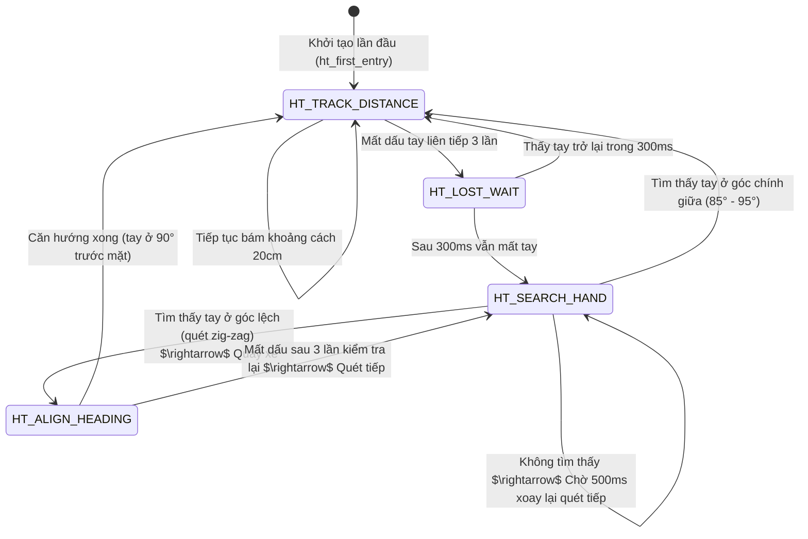

# 🤖 Tổng Hợp Toàn Diện Chế Độ Hand Tracking (Theo Dõi Bàn Tay)

Tài liệu này tổng hợp chi tiết về cơ chế hoạt động, kiến trúc thuật toán, máy trạng thái (FSM), luồng giao tiếp và phân tích lỗi thực tế của **Chế độ Hand Tracking** trên Xe Robot.

---

## 📌 Mục Lục
1. [Tổng Quan Hệ Thống](#1-tổng-quan-hệ-thống)
2. [Sơ Đồ Đấu Nối Phần Cứng](#2-sơ-đồ-đấu-nối-phần-cứng)
3. [Bảng Hằng Số Cấu Hình](#3-bảng-hằng-số-cấu-hình)
4. [Kiến Trúc Thuật Toán & Máy Trạng Thái (FSM)](#4-kiến-trúc-thuật-toán--máy-trạng-thái-fsm)
5. [Tích Hợp Giao Tiếp (Backend & Frontend)](#5-tích-hợp-giao-tiếp-backend--frontend)
6. [Phân Tích Sâu Sự Cố "Đơ Xe & Khoảng Cách Tăng Vọt" (Bug Analysis)](#6-phân-tích-sâu-sự-cố-đơ-xe--khoảng-cách-tăng-vọt-bug-analysis)
7. [Giải Pháp Khắc Phục Khuyến Nghị](#7-giải-pháp-khắc-phục-khuyến-nghị)

---

## 1. Tổng Quan Hệ Thống

Chế độ **Hand Tracking** (Theo dõi bàn tay) cho phép xe tự động duy trì khoảng cách ổn định **20cm** trước một bàn tay hoặc vật cản di động. 
- **Khi tay tiến lại gần (< 16cm):** Xe tự động lùi lại để tránh va chạm.
- **Khi tay rút ra xa (> 24cm):** Xe tự động tiến lên phía trước để bám theo.
- **Khi tay ở trong vùng an toàn (16cm - 24cm):** Xe đứng yên (Vùng chết - Deadzone).
- **Khi mất dấu bàn tay:** Xe dừng lại, kích hoạt cơ chế quét Servo xoay cảm biến siêu âm tìm tay trái/phải, rẽ hướng thân xe để căn chỉnh lại rồi tiếp tục bám đuôi.

---

## 2. Sơ Đồ Đấu Nối Phần Cứng

Hệ thống sử dụng các thành phần phần cứng cốt lõi sau trên Arduino Uno:

| Linh Kiện | Chân (Pin) Arduino | Vai Trò |
| :--- | :--- | :--- |
| **Cảm biến Siêu âm HC-SR04** | `TRIG` $\rightarrow$ **A5**<br>`ECHO` $\rightarrow$ **A4** | Đo khoảng cách từ đầu xe tới bàn tay bằng sóng siêu âm. |
| **Servo SG90** | `Signal` $\rightarrow$ **D3** | Xoay cảm biến siêu âm (từ 5° đến 175°) để quét tìm tay khi mất dấu. |
| **L298N Motor Driver** | `ENA` $\rightarrow$ **D5** (PWM)<br>`ENB` $\rightarrow$ **D6** (PWM)<br>`IN1` $\rightarrow$ **D7**, `IN2` $\rightarrow$ **D8**<br>`IN3` $\rightarrow$ **D9**, `IN4` $\rightarrow$ **D11** | Điều khiển hướng và tốc độ động cơ DC của xe. |

---

## 3. Bảng Hằng Số Cấu Hình

Các hằng số định nghĩa hành vi và ngưỡng phản hồi của xe được cấu hình trong [SmartCar_Core_20210127.ino](file:///home/ddd/project_car_kit/robot_car_kit/SmartCar_Core_20210127/SmartCar_Core_20210127.ino#L67-L96):

| Hằng Số | Giá Trị | Đơn Vị | Ý Nghĩa |
| :--- | :--- | :--- | :--- |
| `HT_TARGET_DIST` | `20` | cm | Khoảng cách mục tiêu xe giữ với bàn tay. |
| `HT_DEADZONE` | `4` | cm | Biên độ vùng chết (Vùng không di chuyển: $20 \pm 4$ cm tức là $16 - 24$ cm). |
| `HT_HYSTERESIS` | `3` | cm | Khoảng bù trễ mở rộng vùng chết sau khi xe vừa dừng để tránh rung giật. |
| `HT_SAFE_MIN` | `10` | cm | Khoảng cách nguy hiểm cận kề, dưới mức này xe lùi khẩn cấp tốc độ cao. |
| `HT_MAX_RANGE` | `50` | cm | Phạm vi phát hiện tay tối đa. Vượt quá mức này được coi là mất tay. |
| `HT_SPEED_MIN` | `80` | PWM | Tốc độ tối thiểu của động cơ khi bắt đầu di chuyển. |
| `HT_SPEED_MAX` | `140` | PWM | Tốc độ tối đa giới hạn khi tiến (tránh sụt áp nguồn). |
| `HT_EMA_ALPHA` | `0.45` | hệ số | Hệ số lọc số EMA ($0.0 - 1.0$) lọc nhiễu siêu âm. |
| `HT_RAMP_STEP` | `15` | PWM/50ms | Gia số tăng/giảm tốc độ mỗi chu kỳ để tránh giật dòng điện khởi động. |
| `HT_UPDATE_INTERVAL`| `50` | ms | Tần suất cập nhật tính toán thuật toán Hand Tracking. |
| `HT_STABLE_COUNT` | `3` | lần | Số chu kỳ ổn định liên tiếp cần thiết trước khi đảo chiều động cơ. |
| `HT_SERVO_SETTLE` | `200` | ms | Thời gian chờ Servo xoay ổn định góc trước khi đọc cảm biến siêu âm. |
| `HT_LOST_COUNT` | `10` | lần | Số lần đọc mất tay liên tục ($10 \times 50\text{ms} = 500\text{ms}$) trước khi chuyển sang chế độ quét SEARCH. |
| `HT_ALIGN_SPEED` | `140` | PWM | Tốc độ quay thân xe khi căn chỉnh hướng theo tay. |

---

## 4. Kiến Trúc Thuật Toán & Máy Trạng Thái (FSM)

Chế độ Hand Tracking được triển khai dưới dạng một máy trạng thái hữu hạn (**FSM**) gồm 4 trạng thái chính:



### 4.1. Bộ Lọc Số EMA (Exponential Moving Average)
Để loại bỏ các giá trị siêu âm "ảo" (do nhiễu sóng phản xạ từ nền nhà hoặc bề mặt gồ ghề), giá trị khoảng cách được làm mượt liên tục:
$$\text{ema\_distance} = \alpha \times \text{raw\_dist} + (1 - \alpha) \times \text{ema\_distance}_{\text{cũ}}$$
Với $\alpha = 0.45$, bộ lọc cân bằng tốt giữa khả năng chống nhiễu và độ trễ phản hồi (Response Latency).

### 4.2. Bù Trễ Động & Hysteresis
Để triệt tiêu tình trạng xe tiến/lùi liên tục quanh biên vùng chết do rung tay hoặc quán tính cơ học:
- **Bù trễ động:** Khi xe đang di chuyển, vùng chết bị co hẹp đi $2\text{cm}$ về hướng chuyển động để xe phanh dừng sớm hơn, tránh trôi lố mục tiêu.
- **Hysteresis:** Khi xe vừa dừng lại, vùng chết tạm thời mở rộng thêm $3\text{cm}$ về hướng xe vừa di chuyển ($13 - 27\text{cm}$). Người dùng phải đưa tay gần hơn hẳn hoặc xa hơn hẳn để kích hoạt lại động cơ.

### 4.3. Ramping (Kiểm soát gia tốc)
Tốc độ PWM thực tế tăng dần từng bước `HT_RAMP_STEP` ($15$ đơn vị mỗi $50\text{ms}$) và giảm tốc nhanh gấp đôi để phanh dừng gấp khi cần. Ramping giúp bảo vệ bánh răng hộp số cơ khí và ngăn ngừa hiện tượng quá dòng tức thời gây sụt áp Arduino.

### 4.4. Cơ Chế Xử Lý Khi Tay Di Chuyển Sang Trái/Phải (Quét Servo & Xoay Xe)
Khi người dùng di chuyển bàn tay sang trái hoặc phải vượt ngoài góc mở phát hiện của cảm biến siêu âm lúc hướng thẳng (90°), xe sẽ thực hiện quy trình phát hiện lệch hướng, quét tìm kiếm và xoay thân xe theo tay như sau:

#### Bước 1: Phát hiện mất dấu bàn tay (Lost Detection)
- Khi bàn tay di chuyển ra hai bên, chùm sóng siêu âm hướng thẳng (90°) bắn ra ngoài khoảng không $\rightarrow$ khoảng cách thô vọt lên $> 50\text{ cm}$ (hoặc trả về $0$).
- Để tránh nhiễu nhất thời, xe sử dụng bộ đếm lọc nhiễu mất tay (`lost_debounce_counter`): phải đọc mất tay liên tục **3 lần** ($150\text{ ms}$) mới xác nhận là mất tay tạm thời.
- Nếu mất dấu tay liên tục **10 lần** ($10 \times 50\text{ ms} = 500\text{ ms}$), xe lập tức dừng hoạt động (`stop()`), ghi nhận thời điểm bắt đầu mất tay và chuyển từ trạng thái `HT_TRACK_DISTANCE` sang `HT_LOST_WAIT`.

#### Bước 2: Chờ phục hồi nhanh & Xác định các góc quét
- Ở trạng thái `HT_LOST_WAIT`, xe đứng yên và liên tục kiểm tra xem tay có quay lại hướng chính diện trong vòng **300ms** hay không. Nếu có, xe chuyển thẳng về bám đuôi mà không cần quét.
- Nếu quá 300ms vẫn mất tay, xe tính toán mảng 7 góc quét dựa trên góc hướng tay cuối cùng ghi nhận được (`ht_last_hand_angle`) cộng với các góc lệch (`offsets = {0, -30, 30, -45, 45, -60, 60}`):
  - Thứ tự quét ưu tiên hướng thẳng và góc lệch nhỏ trước, góc lệch lớn sau.
  - Các góc quét được giới hạn an toàn từ **5° đến 175°** để tránh kẹt cơ khí Servo.
  - Chuyển sang trạng thái `HT_SEARCH_HAND`.

#### Bước 3: Quét Servo xoay cảm biến tìm hướng tay (Servo Scan)
Trong trạng thái `HT_SEARCH_HAND`, xe thực hiện xoay servo tuần tự qua 7 góc đã tính:
1. **Move:** Xoay Servo SG90 đến góc cần quét.
2. **Settle (200ms):** Dừng chờ 200ms để Servo đứng im hoàn toàn (tránh sai số đo khi cảm biến đang chuyển động).
3. **Read:** Đọc cảm biến siêu âm, ghi lại khoảng cách vào mảng kết quả.
4. Sau khi quét đủ 7 góc, xe tiến hành **Đánh giá (Evaluate)**: Tìm góc quét nào phát hiện vật cản gần nhất nằm trong khoảng hoạt động có ích ($0 < d < 50\text{ cm}$).

#### Bước 4: Xoay thân xe bám theo tay (Align & Turn)
Nếu tìm thấy tay ở một góc cụ thể (ví dụ góc $\theta$):
- **Trường hợp tay ở chính diện (85° - 95°):** Đưa servo về 90°, chờ ổn định và quay lại trạng thái bám khoảng cách `HT_TRACK_DISTANCE`.
- **Trường hợp tay ở góc lệch ($\theta < 85^\circ$ hoặc $\theta > 95^\circ$):**
  - **Xác định hướng rẽ:**
    - Nếu góc tìm thấy tay $< 90^\circ$ (tay lệch về bên phải xe): Kích hoạt rẽ phải (`right(false, HT_ALIGN_SPEED)`).
    - Nếu góc tìm thấy tay $> 90^\circ$ (tay lệch về bên trái xe): Kích hoạt rẽ trái (`left(false, HT_ALIGN_SPEED)`).
  - **Tính thời gian rẽ tương ứng:**
    Độ lệch góc $\Delta\theta = |\theta - 90|$. 
    Thời gian quay xe được tính tỉ lệ: `turn_duration = Δθ * 12` ms (mỗi độ lệch quay 12ms, ví dụ lệch 45° thì xe quay trong $45 \times 12 = 540\text{ ms}$).
  - **Thực thi:** Xe quay thân trong đúng khoảng thời gian `turn_duration` (dùng `safe_delay()`), sau đó dừng xe, xoay Servo trở lại góc thẳng 90°, chờ 500ms cho Servo ổn định và chuyển sang `HT_ALIGN_HEADING`.

#### Bước 5: Kiểm chứng căn chỉnh (Validation)
Trong trạng thái `HT_ALIGN_HEADING`:
- Đọc lại cảm biến siêu âm ở góc 90° trước mặt xem bàn tay đã xuất hiện ở chính diện hay chưa.
- **Nếu thấy tay:** Căn chỉnh thành công! Xe reset các biến trạng thái và quay về `HT_TRACK_DISTANCE` để tiếp tục bám đuôi.
- **Nếu không thấy tay:** Xe tăng bộ đếm thử lại (`align_retry_count`). Nếu quá 3 lần kiểm tra vẫn không thấy tay trước mặt, xe quay lại trạng thái quét Servo từ đầu (`HT_SEARCH_HAND`).

---

## 5. Tích Hợp Giao Tiếp (Backend & Frontend)

### 5.1. Luồng kích hoạt từ Web App
1. Trên Giao diện Web, người dùng nhấn chọn chế độ **Hand Track** (`RobotMode = "hand-tracking"`).
2. React frontend gọi hàm `handleModeChange` $\rightarrow$ gửi message qua WebSocket tới Backend:
   ```json
   { "type": "mode", "data": { "mode": "hand_tracking" } }
   ```
3. Python Backend (`car_protocol.py`) dịch mode này thành mã lệnh byte protocol gửi qua kết nối Serial (hoặc BLE):
   ```python
   # Chế độ hand_tracking tương ứng mã mode = 3
   # Gói tin truyền: {"N": 3, "D1": 3}
   ```
4. Arduino Uno nhận gói tin, hàm `getBTData_Plus()` phân tích JSON và gán `func_mode = HandTracking`.

### 5.2. Đồng bộ Telemetry
- Khi trong chế độ Hand Tracking, Arduino liên tục cập nhật khoảng cách đo được vào biến toàn cục `CMD_Distance`.
- Arduino truyền chuỗi JSON trạng thái chứa biến `CMD_Distance` về Pi/Backend.
- Backend gửi dữ liệu telemetry qua WebSocket đến React Frontend.
- Giao diện Web hiển thị khoảng cách thực tế trên component **Telemetry Panel** (quy đổi sang mét) và hiển thị hoạt ảnh radar tìm kiếm trên **Control Panel**.

---

## 6. Phân Tích Sâu Sự Cố "Đơ Xe & Khoảng Cách Tăng Vọt" (Bug Analysis)

> **Phản hồi lỗi thực tế (feedback.txt):**
> *"Chế độ Handtracking, sau khi điều hướng và tăng tốc xe vẫn bị đơ, dù backend vẫn nhận được log, nhưng thông số đo khoảng cách lại lên rất cao (150cm)."*

Qua phân tích mã nguồn firmware và hoạt động cơ điện của xe robot, nguyên nhân cốt lõi gây ra hiện tượng này được chỉ rõ như sau:

### Nguyên nhân 1: Hiện tượng sụt áp nguồn (Voltage Sag / Power Dip) do động cơ kéo tải
- Khi xe bắt đầu rẽ hướng (`HT_ALIGN_HEADING` sử dụng `left()` hoặc `right()`) hoặc tăng tốc (`HT_TRACK_DISTANCE` tăng tốc PWM động cơ), 4 động cơ DC cùng hoạt động và rút một lượng dòng điện cực lớn đột ngột từ nguồn pin.
- Nếu pin yếu hoặc mạch nguồn không có cách ly tốt, điện áp nguồn cấp 5V cho Arduino Uno và cảm biến siêu âm HC-SR04 sẽ bị sụt giảm tức thời xuống dưới mức hoạt động danh định (< 4.5V).
- Khi điện áp cấp sụt giảm, cảm biến siêu âm HC-SR04 bị treo, đầu phát sóng không phát đủ năng lượng hoặc đầu thu không kích hoạt được tín hiệu Echo. Lúc này hàm `pulseIn(ECHO_PIN, HIGH, 25000)` sẽ bị quá thời gian chờ (timeout) và trả về `0`.
- Theo logic trong hàm [getDistance()](file:///home/ddd/project_car_kit/robot_car_kit/SmartCar_Core_20210127/SmartCar_Core_20210127.ino#L199-L200):
  ```cpp
  if (duration == 0) {
    tempda_x = 150; // Không có vật cản / ngoài tầm đo
  }
  ```
  Khi cảm biến bị treo do sụt áp, nó sẽ liên tục trả về giá trị giả định **`150` cm**. Đây chính là lý do vì sao *"thông số khoảng cách nhảy lên rất cao (150cm)"*.

### Nguyên nhân 2: Vòng lặp đơ vô hạn trong State Machine (Infinite Search Loop)
Khi khoảng cách nhảy lên `150` cm (lớn hơn `HT_MAX_RANGE = 50`):
1. Thuật toán coi như bị mất tay. Xe chuyển trạng thái từ `HT_TRACK_DISTANCE` $\rightarrow$ `HT_LOST_WAIT` $\rightarrow$ `HT_SEARCH_HAND`.
2. Trạng thái `HT_SEARCH_HAND` thực hiện **dừng xe** (`stop()`), xoay Servo SG90 qua 7 góc khác nhau để tìm bàn tay. Quá trình quét này mất ít nhất **1.5 đến 2 giây** vì mỗi góc cần dừng `HT_SERVO_SETTLE = 200ms` và đo siêu âm. Trong thời gian này xe hoàn toàn đứng yên.
3. Khi quét xong, nếu tìm thấy tay ở một góc lệch, xe gọi hàm xoay thân xe (`left`/`right`) bằng lệnh khóa luồng xử lý:
   ```cpp
   safe_delay(turn_duration); // delay hoàn toàn chặn đứng việc nhận lệnh Bluetooth/Serial
   ```
4. Khi xe xoay thân để căn hướng, động cơ lại hoạt động $\rightarrow$ nguồn tiếp tục bị sụt áp $\rightarrow$ cảm biến siêu âm lại bị treo $\rightarrow$ trả về `150` cm.
5. Vòng lặp này lặp lại vô hạn: **Khởi động motor $\rightarrow$ Sụt áp cảm biến $\rightarrow$ Trả về 150cm (Mất tay) $\rightarrow$ Dừng xe $\rightarrow$ Quét Servo (1.5 - 2s) $\rightarrow$ Phát hiện hướng lệch $\rightarrow$ Xoay xe $\rightarrow$ Khởi động motor $\rightarrow$ Sụt áp cảm biến...**
Kết quả là xe bị giật cục rồi "đơ" hoàn toàn trong trạng thái quét tìm kiếm và xoay tại chỗ, mặc dù Backend vẫn nhận được log từ vòng lặp Bluetooth chạy ngầm.

---

## 7. Giải Pháp Khắc Phục Khuyến Nghị

### 7.1. Giải pháp phần cứng (Quan trọng nhất)
- **Tụ lọc nguồn lớn:** Mắc song song một tụ điện hóa dung lượng lớn (từ $470\mu\text{F}$ đến $1000\mu\text{F}$, điện áp chịu đựng $10\text{V}$ trở lên) trực tiếp vào chân nguồn `VCC` và `GND` của cảm biến siêu âm HC-SR04 để bù áp tức thời khi động cơ khởi động.
- **Nguồn cấp cách ly:** Nếu có thể, hãy tách nguồn nuôi động cơ (qua Driver L298N) và nguồn nuôi vi điều khiển Arduino Uno / cảm biến (sử dụng 2 viên pin riêng biệt hoặc qua module ổn áp DC-DC Buck Converter/BEC chất lượng cao).
- **Kiểm tra Pin:** Sử dụng pin sạc Li-ion 18650 có dòng xả cao (High-drain) thay vì các loại pin chất lượng kém dễ sụt dòng khi chịu tải.

### 7.2. Giải pháp phần mềm (Software Optimization)
- **Bỏ bộ lọc nhiễu dị biệt:** Thêm cơ chế loại bỏ giá trị đọc lỗi đột ngột. Nếu khoảng cách vọt lên `150` cm ngay lập tức từ một giá trị nhỏ (như `20` cm), ta không cập nhật ngay mà cần chờ ít nhất 2 - 3 chu kỳ đo nữa để kiểm chứng (tránh nhiễu sụt áp tức thời).
- **Tối ưu hóa Ramping tăng tốc mềm (Soft Start):** Giảm giá trị `HT_RAMP_STEP` xuống nhỏ hơn (ví dụ từ `15` xuống `8` hoặc `10`) hoặc thực hiện tăng dần PWM mềm hơn nữa khi bắt đầu xoay xe căn hướng để dòng khởi động động cơ không bị tăng đột ngột.
- **Chuyển đổi non-blocking xoay xe:** Thay thế các lệnh `safe_delay()` chặn luồng trong pha căn hướng xe bằng máy trạng thái đếm thời gian phi chặn dòng (sử dụng biến `millis()`). Điều này đảm bảo xe luôn phản hồi lập tức các lệnh thoát chế độ từ Web App và Backend bất cứ lúc nào.
